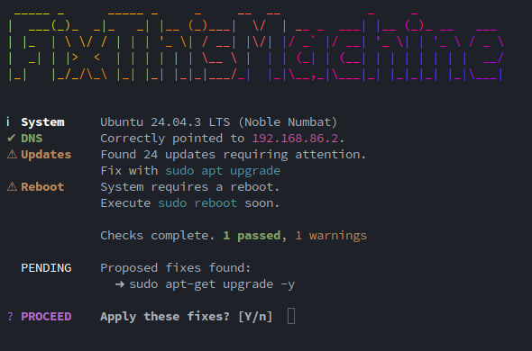

## Homelab

An assortment of homelab centered scripts around running services and exploring technologies.


## docker_monitor.sh

This script will create a tmux session with lazydocker on multiple hosts and htop on each host. It will split the tmux session into columns for each host and then split each column in half to add htop. It will then resize the htop panes to a specified percentage of the tmux session height.

### Usage

```bash
./docker_monitor.sh --session 'session_name' --hosts 'host1,host2,host3'
```

### Flags

- `--session`: Name of the tmux session (required)
- `--hosts`: Comma-separated list of hosts (required)
- `--htop`: Add htop to the session (default: `true`)
- `--htop_size`: Height percentage for the htop panes (default: `25%`)
- `--admin`: Add a full-width SSH row at the bottom for admin tasks (default: `false`)
- `--admin_size`: Height percentage for the admin row (default: `20%`)
- `--reset`: If already open, close and recreate session (default: `false`)
- `--kill`: Look for and kill any existing sessions with the same name (default: `false`)

### Aliases

- `lazydev`: Creates a tmux session with lazydocker and htop on uno, dos, and tres
- `lazyprod`: Creates a tmux session with lazydocker and htop on once, doce, and trece

## fix.sh

A modular system check and fix utility designed for Homelab infrastructure. It scans and runs parallel checks across multiple system components (like DNS, updates, and reboots) and provides an interactive dashboard to apply proposed fixes.

### Features

- **Parallel Execution**: Runs all system modules simultaneously in the background.
- **Live Dashboard**: Provides a real-time terminal UI showing active and completed checks.
- **Modular**: Automatically discovers and loads check modules from the `fix-modules/` directory.
- **Cross-Platform**: Built-in support for Ubuntu (apt/ESM) and Arch Linux (pacman/AUR).
- **Interactive Fixes**: Proposes terminal commands to fix detected issues and applies them upon confirmation.

### Usage

```bash
fix
```



### Flags

- `--apply (-a)`: Automatically apply all proposed fixes without confirmation.
- `--quiet (-q)`: Suppress all optional output and only show critical errors/dashboard.
- `--header / --noheader`: Show or hide the ASCII banner. (Default: Show)
- `--summary / --nosummary`: Display a final pass/fail summary report. (Default: Show)
- `--success / --nosuccess`: Toggle visibility of success messages. (Default: Show)
- `--warning / --nowarning`: Toggle visibility of warning messages. (Default: Show)
- `--debug (-d)`: Enable verbose output for troubleshooting. (Default: Hidden)
- `--security_updates`: Show Ubuntu ESM/Pro security updates in the report. (Default: Hidden)
