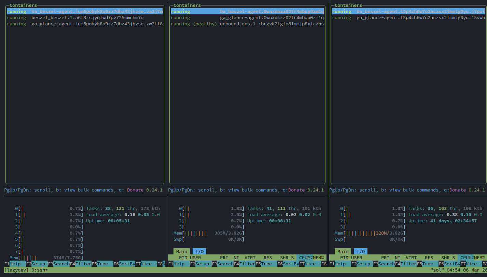
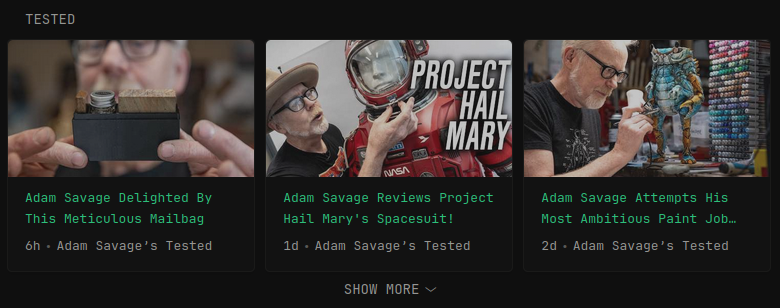

## Homelab

An assortment of homelab centered scripts around running services and exploring technologies.


## scripts/docker_monitor.sh

This script creates a tmux session with `lazydocker` and `htop` on multiple hosts. It organizes the session into columns for each host, splits each column to add `htop`, and can optionally add a full-width **Admin Pane** at the bottom for quick terminal access. If the admin pane is enabled, it automatically runs `clear` to provide a clean workspace.

### Usage




```bash
/data/linux/scripts/docker_monitor.sh --session 'session_name' --hosts 'host1,host2,host3'
```

### Flags

- `--session`: Name of the tmux session (required)
- `--hosts`: Comma-separated list of hosts (required)
- `--htop`: Add htop to the session (default: `true`)
- `--htop_size`: Height percentage for the htop panes (default: `25%`)
- `--admin (-a)`: Add a full-width SSH row at the bottom for admin tasks (default: `false`)
- `--admin_size`: Height percentage for the admin row (default: `20%`)
- `--reset (-r)`: If already open, close and recreate session (default: `false`)
- `--kill (-k)`: Look for and kill any existing sessions with the same name (default: `false`)

### Aliases

- `lazydev`: Creates a tmux session with lazydocker and htop on uno, dos, and tres
- `lazyprod`: Creates a tmux session with lazydocker and htop on once, doce, and trece

## scripts/fix

A modular system check and fix utility designed for Homelab infrastructure. It scans and runs parallel checks across multiple system components (like checking CLI tools, Bashrc synchronization, and SSH key states) and provides an interactive dashboard to apply proposed fixes.

### Features

- **Parallel Execution**: Runs all system modules simultaneously in the background.
- **Live Dashboard**: Provides a real-time terminal UI showing active and completed checks.
- **Modular**: Automatically discovers and loads check modules from the `scripts/fix/modules/` directory.
- **Cross-Platform**: Built-in support for Ubuntu (apt/ESM) and Arch Linux (pacman/AUR).
- **Interactive Fixes**: Proposes terminal commands to fix detected issues and applies them upon confirmation.

### Usage


```bash
fix
```
### Flags

- `--apply (-a)`: Automatically apply all proposed fixes without confirmation.
- `--quiet (-q)`: Suppress all optional output and only show critical errors/dashboard.
- `--header / --noheader`: Show or hide the ASCII banner. (Default: Show)
- `--summary / --nosummary`: Display a final pass/fail summary report. (Default: Show)
- `--success / --nosuccess`: Toggle visibility of success messages. (Default: Show)
- `--warning / --nowarning`: Toggle visibility of warning messages. (Default: Show)
- `--debug (-d)`: Enable verbose output for troubleshooting. (Default: Hidden)
- `--security_updates`: Show Ubuntu ESM/Pro security updates in the report. (Default: Hidden)

## scripts/glance_watcher.sh

A highly optimized file watching utility that monitors the Glance configuration directory. When changes to `.yml` or `.yaml` files are detected, it forcefully reloads the Docker Swarm `dash_glance` service. 

### Features

- **Zero-CPU Idling**: Prefers `inotifywait` to handle real-time kernel filesystem events with 0 overhead.
- **Graceful Fallback**: Automatically senses NFS mounts and falls back to a clean timestamp polling loop if `inotify` is unsupported.
- **Tmux Integration**: Native remote host-jumping. Automatically creates and launches itself inside a detached `glance_watcher` tmux session on the target host.

## scripts/glance_youtube.py

A utility for managing YouTube channels within [Glance](https://github.com/glanceapp/glance) configuration files. It handles fetching channel details via `yt-dlp`, normalizing categories, and triggering Glance restarts via webhooks.

### Features

- **Channel Management**: Easily add or remove channels using YouTube handles (e.g., `@TheSwedishMaker`) or Channel IDs.
- **Auto-Discovery**: Automatically fetches canonical Channel IDs and handles using `yt-dlp`.
- **Category Resolution**: Supports partial category name matching (e.g., `fav` -> `favorites`) and enforces constraints (e.g., Favorites must coexist in a content category).
- **Restart Integration**: Detects changes and prompts to trigger a Glance restart webhook, or handles it automatically with flags.
- **Search & Inspection**: Search across all category YAML files or fetch YouTube IDs for specific handles.

### Usage

```bash
# Add a channel to specific categories
/data/linux/scripts/glance_youtube.py --add @JeffGeerling homelab makers

# Remove a channel (optionally from a specific category)
/data/linux/scripts/glance_youtube.py --remove @JeffGeerling homelab

# Search for a channel
/data/linux/scripts/glance_youtube.py --find tested

# List all available categories
/data/linux/scripts/glance_youtube.py -l

# List channels in specific categories (sorted)
/data/linux/scripts/glance_youtube.py -l makers family
```

### Flags

- `--add QUERY`: Add a channel by ID or handle. QUERY: 'handle/ID category [category] ...'
- `--remove QUERY`: Remove channel(s) by search term. QUERY: 'search-term [category]'
- `--find QUERY (-f)`: Search for a channel by ID or handle (case-insensitive).
- `--list (-l) [CAT ...]`: List categories. If category(s) specified, list channels in those categories.
- `--restart (-r)`: Trigger restart of the glance service via webhook after processing.
- `--force`: Force default selection at any prompt (e.g., skip confirmation for removal or restart).
- `--get_id HANDLE`: Fetch the canonical YouTube ID for a handle and exit.

### Glance integration

The files populated by this tool exist in `/data/docker/glance/config/yt` which is used in the docker configuration for `glance`. My glance pages use a similar structure to import the files: 



```bash
❯ grep -B1 -A5 "title: Makers" config/youtube.yml 
        - type: videos
          title: Makers
          collapse-after-rows: 1
          limit: 40
          style: grid-cards
          channels:
            $include: yt/makers.yml
```

While the `yt/makers.yml` looks similar to:

```bash
❯ head -2 config/yt/makers.yml 
- UC39z4_U8Kls0llAij3RRZAQ # @3x3CustomTamar 
- UCWizIdwZdmr43zfxlCktmNw # @AlecSteele 
```